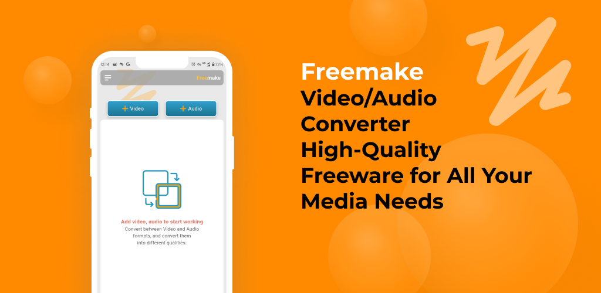

## Freemake ༶

### Freemake Video/Audio Converter
### High-Quality Freeware for All Your Media Needs

Convert Videos/Audios to Multiple Formats with Freemake’s Reliable and Free Software, Supporting All Popular and Rare Formats for Various Devices.

## Previews ⛶

         

## Who is Freemake For?
### Casual Users
Ideal for those who need a simple, free solution for converting videos/audios for social media or personal projects.

### Tech Enthusiasts
Appreciated for its extensive format support and advanced features, perfect for managing large media files.

### Content Creators
Reliable for converting videos/audios into formats compatible with various popular social media platforms.

### Professionals
Valuable for its wide format support and high-quality output, making it an excellent, cost-free choice for professional use.

## How does Freemake work?
### Add your files
To begin, simply click the "Add Video" or "Add Audio" button to select the files you wish to convert.

### Choose an output format
Select the format you want to convert your files to from the list of available options. Freemake supports a wide variety of formats, including MP4, AVI, WMV, MP3, and more.

### Convert your files
Click the "Convert" button to start converting your files. The conversion time will vary depending on the size and format of your files.